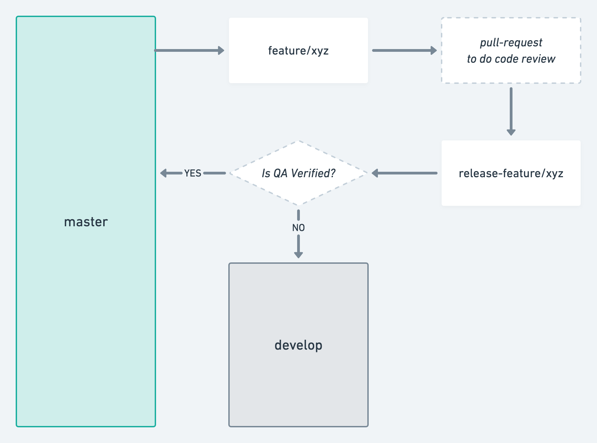

In this post, I will present a workflow that can help “fast” paced, small teams that are managing multiple projects. It’s a variation of the classic git-flow, with alterations to support the development and QA testing cycles of multiple features in parallel.

I have worked with different teams over time, and with every group, we always had one secondary environment separate from production. We used this environment for testing before the production release. Quite often, there were situations when the release of a tested feature would get blocked by other untested feature. It happened because we would merge multiple feature branches into a develop branch, and for production release, we followed the flow to merge develop into master. Cherry-picking helped many a time, but I brainstormed some ideas off my close friend Ankur Bohra, and I will present those ideas here in this article.

### 1. master

As it should be, the master branch is the production branch.

### 2. develop

The develop branch will have the latest development changes that are ready for QA testing, and targeted to be released to production soon after QA testing.

### 3. feature branches

For feature developments, every feature should have its dedicated branch. Create new feature branches from the master branch.

Follow a basic naming convention, something like `feature/{{task-id}}-{{short-task-title}}`.\
For example, `feature/12-signup`

In addition to this “feature” class, there are other code change classes like - hotfix, refactor, bugfix, task.

### 4. Code review

After feature development is completed, the next important step is code review.
Create a pull request from a feature branch to develop branch

Alternate strategy (optional), is to create a feature release branch from master; and raise a pull-request from a feature development branch to its release branch.

Again, follow a basic naming convention, something like `release-feature/{{task-id}}-{{short-task-title}}`.\
For example, `release-feature/12-signup`

Squashing strategy can be considered over the development commits in a feature branch; before merging them to develop.

### 5. QA testing

After code-review, the next step before production deployment is to get the feature tested by the QA team.

For the testing release, raise a pull request from feature to develop branch, get approvals from teammates for release, and then merge to develop and deploy.

Avoid squashing commits while merging to develop branch (and master branch).

If any issues are raised from the QA process, do those code changes over feature release branch. Raise a pull request to get new code changes tested, and after review merge them to the develop branch. Redeploy the test environment, and continue the QA testing cycle.

### 6. Production release

Once a feature passes the QA testing process, don’t delay production release. Raise a pull request from the feature branch to master branch, get approvals from teammates for release, and then merge to master and deploy production.

#### So, how does this help?

- This helps in managing releases of independent features, as it avoids bottleneck on develop branch that can potentially happen through the QA cycle.
- Each step of this process is recorded in the git history; the merge commit marks the code-review steps, and the subsequent commits made after QA testing highlights the importance of QA process helping identifying issues before the production release.

#### And, the cons of this?

- Conflict resolution is a bit tedious. To merge feature branch changes to develop, a temporary arbitrator branch would be needed. As we can’t pull develop branch directly into feature branch; because that pull might bring in some untested code.

  For the arbitrator branch, for a basic naming convention; something like `merge-feature/develop/{{task-id}}-{{short-task-title}}`.\
  For example, `merge-feature/develop/12-signup`

- After feature change is merged to master branch, one additional step is needed to merge master into the develop branch. This additional step, syncs develop with master and its extra merge commits.

So, what do y’all think about this workflow?
